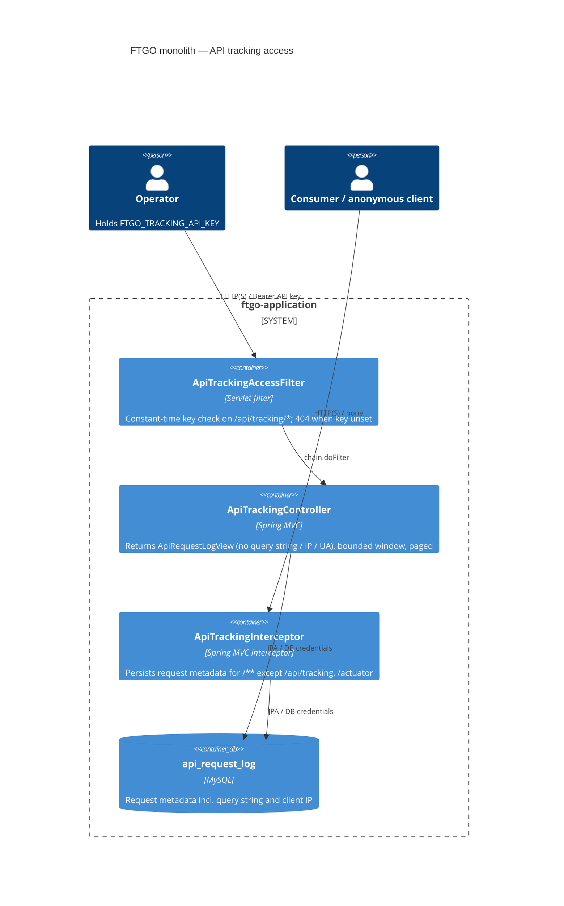

# 0001. Operator API key for the `/api/tracking` request-log endpoints

- **Status:** Proposed
- **Date:** 2026-09-30
- **ARB ticket:** TO BE CREATED
- **Authors:** Devin (security-finding remediation)
- **Owning team:** FTGO platform (TBD — owner to confirm before ARB)
- **Related ADRs:** none

## Context

`ApiTrackingInterceptor` (in `ftgo-common`) persists every inbound request — method, URI, raw
query string, client IP, `User-Agent`, status, duration and error message — into the
`api_request_log` table. `ApiTrackingController` read that table back and served it, unfiltered,
on `GET /api/tracking/**` to any anonymous caller. The monolith ships with no Spring Security or
other authentication layer, so any network peer could dump cross-user traffic metadata and
sensitive query parameters (`consumerId`, order ids, …) for the whole deployment
(code-scan finding `sfind-52fa46692fd54c1eb8a212c11778fbf3`).

Constraints: Spring Boot 2.0.x / Java 8; no identity provider or user model exists in the
application; the endpoints are operator-only monitoring aids with no UI consumer.

ARB triggers: T6 (introduces an authentication mechanism on an existing HTTP surface). The
heuristic detector reported NO_ARB; T6 was added on manual review of the diff.

## Decision

We will gate `/api/tracking/**` behind a shared operator secret, `ftgo.tracking.api-key`
(env `FTGO_TRACKING_API_KEY`), enforced by a servlet filter (`ApiTrackingAccessFilter`) that
runs before dispatch, compares the presented `Authorization: Bearer <key>` /
`X-Tracking-Api-Key` value in constant time, and returns 404 when no key is configured (secure by
default). The endpoints return a minimal DTO (`ApiRequestLogView`) that omits query strings,
client IPs and user agents, bound `minutesBack` to 24 h, and page results (`limit` ≤ 1000).

## Alternatives considered

| Alternative | Pros | Cons | Why rejected |
| --- | --- | --- | --- |
| Do nothing | No change | Anonymous exfiltration of all request metadata remains possible | Unacceptable information-disclosure risk |
| Add Spring Security with HTTP Basic / role-based access | Standard framework, extensible to other endpoints | New framework dependency on Boot 2.0.x; default-secures every endpoint (breaks e2e tests / dashboard) unless broadly `permitAll`'d and CSRF-disabled; no user store exists to back roles | Disproportionate scope for a monitoring endpoint; better done as a platform-wide decision |
| Delete the endpoints / stop persisting logs | Removes the sink entirely | Loses the operational diagnostics the feature was added for | Endpoints remain useful to operators when protected |
| Restrict by network only (bind to management port / reverse-proxy ACL) | No code auth | Relies on deployment config not present in this repo; app binds a single port | Not enforceable from the codebase |

## Architecture

## Non-functional requirements

| NFR | Target | How met |
| --- | --- | --- |
| Availability SLO | Same as ftgo-application (TBD — owner to confirm before ARB) | Filter is in-process, no external calls |
| p95 latency | Negligible overhead (< 1 ms header compare) | Constant-time byte comparison, no I/O |
| RPO / RTO | N/A — no new data store | |
| Peak load | Operator-only traffic; result sets capped at 1000 rows, window capped at 24 h | `limit`/`minutesBack` validation |
| Scaling model | Stateless; scales with the application | |
| Data retention | Unchanged — `api_request_log` retention is TBD (see open questions) | |

## Security & compliance

- **Data classification:** Internal / confidential — request metadata includes user identifiers in query strings and client IPs.
- **Encryption at rest:** N/A — no new store; MySQL as currently deployed.
- **Encryption in transit:** As per deployment (TLS termination is outside this repo).
- **AuthN / AuthZ:** Shared operator secret via `Authorization: Bearer` or `X-Tracking-Api-Key`; unset key disables the endpoints (404). Authorization is binary (operator or not).
- **Secrets:** `FTGO_TRACKING_API_KEY` environment variable; not committed. Secrets-manager integration TBD per deployment.
- **Audit logging:** Rejected requests return 401/403 without body; access to `/api/tracking/**` is not itself persisted (excluded from the interceptor) — see open questions.
- **Data residency / regions:** Unchanged.
- **Policy sections satisfied:** N/A — no cloud infrastructure in this change.
- **Threats considered:** anonymous bulk export (blocked by key + 404 default), timing attacks on key compare (constant-time), unbounded queries / DoS via `minutesBack` (bounded), disclosure of other users' query parameters and IPs (removed from DTO), key brute force (long random key expected; no rate limiting — see open questions).

## Cost

| Item | Assumption | Monthly estimate |
| --- | --- | --- |
| Compute / storage | No new resources | $0 |
| **Total** | | $0 |

## Operations

- **On-call rotation:** existing ftgo-application rotation (TBD — owner to confirm before ARB).
- **Runbook:** set `FTGO_TRACKING_API_KEY` in the deployment environment; rotate by redeploying with a new value. Endpoints answer 404 until it is set.
- **Dashboards / alarms:** none new.
- **Rollback plan:** revert the commit; endpoints return to unauthenticated (not recommended).
- **Migration / cut-over plan:** none — clients of `/api/tracking/**` must start sending the key; response payload loses `queryString`, `remoteAddr`, `userAgent`.

## Policy exceptions requested

| Rule | Resource | Justification | Compensating control | Expiry |
| --- | --- | --- | --- | --- |
| none | | | | |

## Consequences

- Positive: closes anonymous exposure of request logs; secure by default; smaller, paged, bounded responses.
- Negative / risks: shared static secret (no per-operator identity or revocation short of rotation); no rate limiting on key guesses.
- Follow-ups: replace with platform-wide authentication (Spring Security / IdP) if/when the platform adopts one; consider redacting query strings at capture time and adding retention for `api_request_log`.

## Open questions

- Owning team / on-call rotation for ftgo-application.
- Should `api_request_log` stop capturing raw query strings and client IPs entirely, and what retention applies?
- Should operator access to `/api/tracking/**` be audit-logged?
