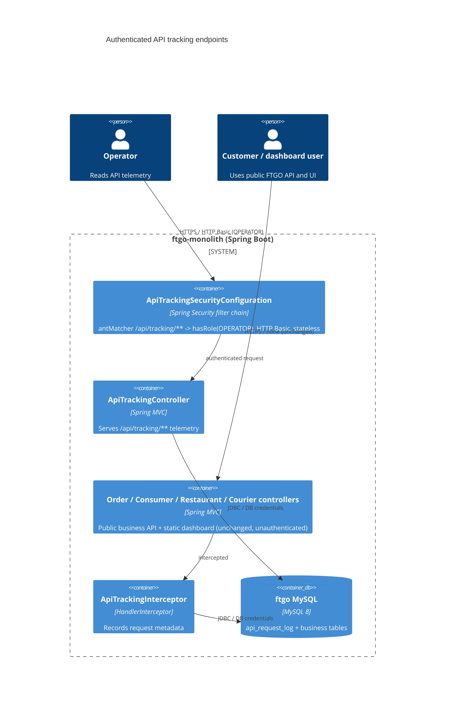

# 0001. Authenticate the API tracking endpoints

- **Status:** Proposed
- **Date:** 2026-09-30
- **ARB ticket:** TO BE CREATED
- **Authors:** Devin (automated security remediation, finding sfind-6bf61dc24e804ed69c8178a7f8e871c9)
- **Owning team:** TBD — ftgo-monolith maintainers to confirm before ARB
- **Related ADRs:** none (first ADR in this repository)

## Context

`ApiTrackingInterceptor` persists metadata for every HTTP request handled by the monolith
(request URI, raw query string, client IP, User-Agent, response status, timing, exception
message) into the `api_request_log` table. `ApiTrackingController` exposes that data over
`GET /api/tracking/**` (`/logs`, `/logs/errors`, `/logs/search`, `/logs/{correlationId}`,
`/stats`). The application had no authentication or authorization anywhere: no Spring Security,
no filter, no interceptor-based gate. Any anonymous caller could therefore read all captured
telemetry, including other users' query strings and error messages (broken access control +
sensitive data exposure). Excluding `/api/tracking/**` from the tracking interceptor is not an
access control.

Constraints: Spring Boot 2.0.3 / Java 8 monolith; the operations dashboard (static JS) and the
public REST API must keep working unauthenticated exactly as before; the diff must be minimal
and scoped to the vulnerability.

ARB triggers: T6 (authentication/authorization change — introduces an authn/authz boundary
around an existing endpoint group). No new service, data store, vendor, or infrastructure.

## Decision

We will add `spring-boot-starter-security` to `ftgo-common` and register a single Spring Security
filter chain (`ApiTrackingSecurityConfiguration`) scoped to `/api/tracking/**` that requires HTTP
Basic authentication with role `OPERATOR`; every other path is not matched by the chain and keeps
its current unauthenticated behaviour. The operator account is supplied through the standard
Spring Boot `spring.security.user.*` properties (username/password from the environment, role
defaulted to `OPERATOR` in `application.properties`). If no credentials are configured, Spring Boot
generates a random password at startup, so the endpoints fail closed.

## Alternatives considered

| Alternative | Pros | Cons | Why rejected |
| --- | --- | --- | --- |
| Do nothing | No change | Anonymous disclosure of all request metadata remains exploitable | Unacceptable security exposure |
| Hand-rolled API-key filter/interceptor on `/api/tracking/**` | No new dependency | Custom auth code, no standard credential/role model, easy to get wrong | Prefer framework primitive over bespoke auth |
| Remove `ApiTrackingController` entirely | Smallest attack surface | Loses operator observability that the tracking feature was built for | Breaks existing legitimate functionality |
| Redact query strings / errors but keep endpoints public | Reduces sensitivity | Still leaks URIs, IPs, User-Agents to anyone; not access control | Does not break the attack path |

## Architecture

## Non-functional requirements

| NFR | Target | How met |
| --- | --- | --- |
| Availability SLO | Unchanged from monolith — TBD — owner to confirm before ARB | In-process filter; no new runtime dependency |
| p95 latency | Negligible overhead (single filter chain evaluated only for `/api/tracking/**`) | Ant matcher short-circuits all other paths |
| RPO / RTO | N/A — no new data store | |
| Peak load | Unchanged — TBD — owner to confirm before ARB | |
| Scaling model | Stateless (no HTTP session created) | `SessionCreationPolicy.STATELESS` |
| Data retention | Unchanged (`api_request_log` retention is out of scope) | |

## Security & compliance

- **Data classification:** Internal / operational telemetry that may contain PII (client IPs, query strings) — access now limited to operators.
- **Encryption at rest:** N/A — no new data store; existing MySQL configuration unchanged.
- **Encryption in transit:** HTTP Basic credentials must only traverse TLS; TLS termination is a deployment responsibility (TBD — owner to confirm).
- **AuthN / AuthZ:** Spring Security HTTP Basic; `hasRole("OPERATOR")` on `/api/tracking/**`; 401 for anonymous/invalid credentials, 403 for authenticated non-operators.
- **Secrets:** Operator username/password via `SPRING_SECURITY_USER_NAME` / `SPRING_SECURITY_USER_PASSWORD` environment variables (never committed). Without them Spring Boot generates a random password and logs it once at startup.
- **Audit logging:** Spring Security logs authentication failures at DEBUG; the tracking interceptor already logs every request. Dedicated audit trail — TBD.
- **Data residency / regions:** Unchanged.
- **Policy sections satisfied:** No infrastructure change; no `approved-infra.yaml` in this repo.
- **Threats considered:** Anonymous enumeration of telemetry (mitigated); credential brute force over Basic (mitigation: strong password, TLS; rate limiting TBD); CSRF (not applicable — stateless GET-only API, CSRF disabled only within this chain).

## Cost

| Item | Assumption | Monthly estimate |
| --- | --- | --- |
| Additional library on classpath | No new infrastructure or runtime services | $0 |
| **Total** | | $0 |

## Operations

- **On-call rotation:** TBD — owner to confirm before ARB
- **Runbook:** Set `SPRING_SECURITY_USER_NAME` / `SPRING_SECURITY_USER_PASSWORD` in the deployment environment; operators call `/api/tracking/**` with HTTP Basic.
- **Dashboards / alarms:** Unchanged
- **Rollback plan:** Revert the commit; the endpoints become public again (not recommended).
- **Migration / cut-over plan:** None; operator credentials must be provisioned before deploying so tooling that consumes `/api/tracking/**` keeps working.

## Policy exceptions requested

| Rule | Resource | Justification | Compensating control | Expiry |
| --- | --- | --- | --- | --- |
| none | | | | |

## Consequences

- Positive: closes anonymous access to request telemetry; introduces a framework-standard place to hang future authentication rules.
- Negative / risks: Spring Security is now on the classpath of every module depending on `ftgo-common`; any future Spring context that enables auto-configuration without importing `ApiTrackingConfiguration` would get Spring Boot's default deny-all chain. Single shared operator account (no per-user identity).
- Follow-ups: consider redacting query strings / error messages in responses and bounding result sizes; integrate with an organisational IdP instead of a static account.

## Open questions

- Owning team / on-call rotation for ftgo-monolith.
- Whether an IdP-backed operator identity is required instead of a single static account.
