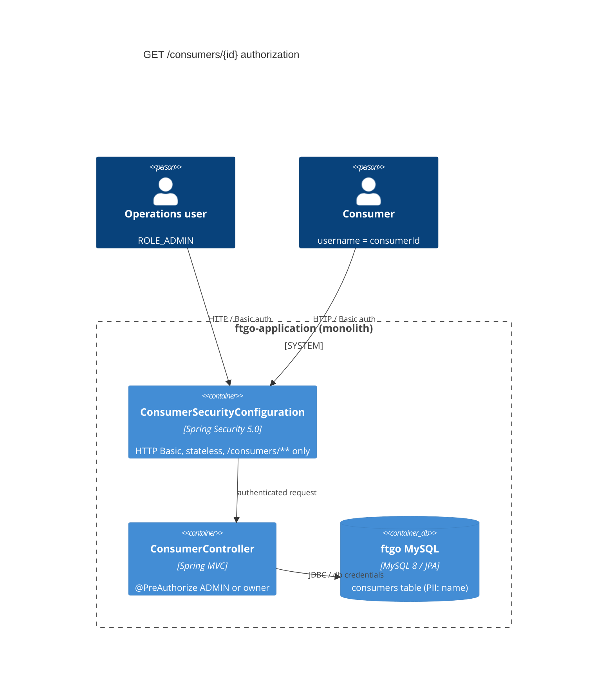

# 0001. Authenticate and authorize `GET /consumers/{consumerId}`

- **Status:** Proposed
- **Date:** 2026-09-30
- **ARB ticket:** TO BE CREATED
- **Authors:** Devin (security finding sfind-2fbf4ea5c9a84d93add5bdbc0fa384d4)
- **Owning team:** TBD — ftgo-monolith maintainers to confirm before ARB
- **Related ADRs:** none (first ADR in this repository)

## Context

`GET /consumers/{consumerId}` in `ftgo-consumer-service` returned the consumer's personal name for
any path id with no authentication or ownership check. Consumer ids are auto-increment `Long`s, so
an anonymous caller could enumerate ids and harvest PII (IDOR). The application had no
authentication layer at all: Spring Security was not on the classpath and no controller performed
authorization.

Constraints: keep the diff scoped to the vulnerable endpoint; preserve behaviour of all other
endpoints (the end-to-end tests and the operations dashboard call `POST /consumers`, `/orders`,
`/restaurants`, `/couriers` anonymously); no consumer credential store exists today.

ARB triggers: T6 (authorization change on an existing public endpoint). T3/T7 not triggered:
`spring-boot-starter-security` is an existing-framework module pinned to the Spring Boot 2.0.3
BOM version, makes no network calls, and introduces no vendor.

## Decision

We will protect `GET /consumers/**` with Spring Security (HTTP Basic, stateless) inside
`ftgo-consumer-service`, and enforce at the controller with `@PreAuthorize` that the authenticated
principal either holds `ROLE_ADMIN` (operations users) or has a username equal to the requested
`consumerId` (a consumer reading its own record). Anonymous requests receive 401, authenticated
non-owners receive 403. Only the `/consumers/**` filter chain is registered, so every other endpoint
keeps its previous (unauthenticated) behaviour. The operations user is Spring Boot's built-in
in-memory user (`spring.security.user.*`) granted `ADMIN`; its password is a generated secret logged
at startup unless supplied via `SPRING_SECURITY_USER_PASSWORD`.

## Alternatives considered

| Alternative | Pros | Cons | Why rejected |
| --- | --- | --- | --- |
| Do nothing | no change | PII enumerable by anyone | unacceptable; open security finding |
| Remove the endpoint / stop returning the name | smallest code change | breaks the public API contract for legitimate callers | violates "preserve interfaces" constraint |
| Global API key filter on every endpoint (see branch `devin/*-api-key-authentication`) | one shared control | shared secret gives every caller access to every consumer (no ownership); breaks e2e tests, dashboard, Swagger and actuator | does not address IDOR, far larger blast radius |
| Non-enumerable (UUID) consumer ids | reduces guessability | schema migration + API contract change; security by obscurity only | out of scope for this fix; may complement it later |

## Architecture

## Non-functional requirements

| NFR | Target | How met |
| --- | --- | --- |
| Availability SLO | unchanged — TBD, owner to confirm before ARB | in-process filter, no new runtime dependency |
| p95 latency | unchanged (in-memory auth, no I/O) | stateless HTTP Basic, no session store |
| RPO / RTO | N/A — no new data | — |
| Peak load | unchanged | — |
| Scaling model | unchanged (stateless) | `SessionCreationPolicy.STATELESS` |
| Data retention | unchanged | — |

## Security & compliance

- **Data classification:** consumer personal name = PII; now readable only by ADMIN or the owning principal.
- **Encryption at rest:** unchanged (existing MySQL).
- **Encryption in transit:** HTTP Basic sends credentials per request; deployments MUST terminate TLS in front of the app (TBD — owner to confirm ingress).
- **AuthN / AuthZ:** Spring Security HTTP Basic; `@PreAuthorize("hasRole('ADMIN') or authentication.name == T(String).valueOf(#consumerId)")`.
- **Secrets:** no credentials in source. Ops password is generated per start or injected via `SPRING_SECURITY_USER_PASSWORD`.
- **Audit logging:** existing `ApiTrackingInterceptor` logs each request; 401/403 statuses are recorded.
- **Data residency / regions:** unchanged.
- **Policy sections satisfied:** N/A — no cloud infrastructure in this repo.
- **Threats considered:** id enumeration (blocked: 401), horizontal privilege escalation (blocked: 403), CSRF (N/A: stateless, no cookie session; CSRF filter disabled only for this chain), credential brute force (TBD — rate limiting at ingress, owner to confirm).

## Cost

| Item | Assumption | Monthly estimate |
| --- | --- | --- |
| none | in-process library, no new infrastructure | $0 |
| **Total** | | $0 |

## Operations

- **On-call rotation:** TBD — owner to confirm before ARB
- **Runbook:** TBD; operator credentials: `SPRING_SECURITY_USER_NAME` / `SPRING_SECURITY_USER_PASSWORD` env vars (defaults: `user` / generated, printed at startup).
- **Dashboards / alarms:** existing actuator/Prometheus metrics; consider alerting on 401/403 spikes for `/consumers/**`.
- **Rollback plan:** revert the PR; no data migration involved.
- **Migration / cut-over plan:** clients that call `GET /consumers/{id}` must send credentials from the release onward.

## Policy exceptions requested

| Rule | Resource | Justification | Compensating control | Expiry |
| --- | --- | --- | --- | --- |
| none | | | | |

## Consequences

- Positive: IDOR closed; a reusable authentication layer now exists for other services to adopt.
- Negative / risks: callers of `GET /consumers/{id}` need credentials; there is no consumer credential store yet, so today only ADMIN users can read consumer records.
- Follow-ups: apply the same pattern to `GET /orders?consumerId=` and other per-consumer endpoints; introduce a real consumer identity provider; consider non-enumerable ids.

## Open questions

- Owning team, on-call and ingress TLS termination — TBD, owner to confirm before ARB.
- Should the operations user move from `spring.security.user.*` to an external IdP?
