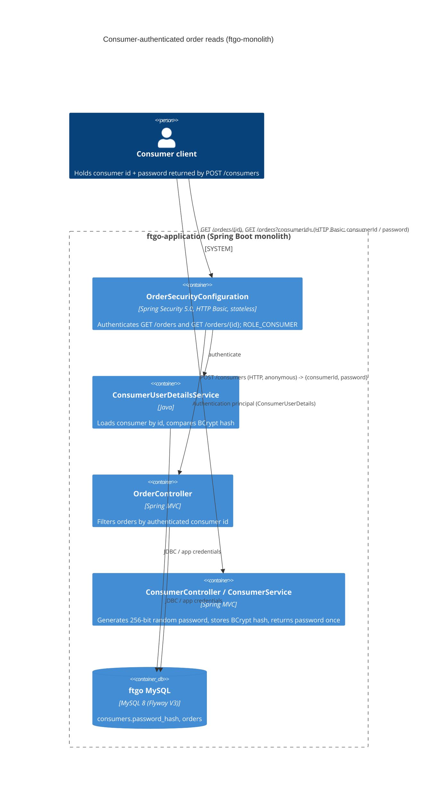

# 0001. Consumer authentication and ownership checks for order reads

- **Status:** Proposed
- **Date:** 2026-09-30
- **ARB ticket:** TO BE CREATED
- **Authors:** Devin (code-scan remediation, finding sfind-f0db7e2dff7044c3889aa493ad0198a2)
- **Owning team:** TBD — owner to confirm before ARB (no CODEOWNERS / service catalog in repo)
- **Related ADRs:** none (first ADR in this repository)

## Context

`GET /orders/{orderId}` and `GET /orders?consumerId=` in `ftgo-order-service` are reachable with no
authentication and no ownership check. Order and consumer ids are sequential surrogate keys, so any
anonymous caller can enumerate every order in the system and dump any consumer's order history
(state, total, restaurant, assigned courier, delivery ETA). The monolith has no identity concept at
all today: no Spring Security, no principal, no credentials on `Consumer`.

Constraints: keep the change scoped to the reported vulnerability, preserve the existing API shape
for legitimate callers, fail closed, and use framework primitives (Spring Security) rather than
hand-rolled auth. Spring Boot 2.0.3 / Java 8 is the current runtime.

ARB triggers: T6 (authentication/authorization change on a public endpoint), T2 (schema change:
`consumers.password_hash`, credential material stored where none was before).

## Decision

We will authenticate the order-read endpoints and the consumer-initiated `cancel` / `revise` actions (which also return order details) with HTTP Basic (Spring Security, stateless) using
per-consumer credentials issued once at `POST /consumers` and stored only as a BCrypt hash in
`consumers.password_hash`, and we will derive the consumer identity from the authenticated principal:
`GET /orders/{orderId}` returns 404 unless the order belongs to the caller, and `GET /orders?consumerId=`
returns 403 unless `consumerId` equals the caller's id. All other endpoints keep their current
(unauthenticated) behaviour in this change.

## Alternatives considered

| Alternative | Pros | Cons | Why rejected |
| --- | --- | --- | --- |
| Do nothing | No change | Anonymous IDOR remains; sequential ids make full enumeration trivial | Confirmed vulnerability, high impact |
| Single shared API key (`X-API-Key`) for the whole app (as in branch `devin/…-api-key-authentication`) | Tiny diff, no schema change | Any key holder can still read any consumer's orders; key must be shared with every client; no per-consumer identity so ownership cannot be enforced | Does not close the object-level authorization gap the finding describes |
| Trusted identity header (e.g. `X-Consumer-Id`) set by a gateway | No credential storage | Monolith is directly reachable; header is client-controlled so the check is trivially bypassed | No trusted boundary exists in the monolith deployment |
| Signed JWT verified with a shared secret, issued by an external auth server | No schema change, stateless | Requires a new external dependency (jjwt) and an auth server that does not exist; Spring Security 5.0 has no resource-server support; tests would mint tokens with the shared secret | Larger surface and an unowned issuer component for the same outcome |

## Architecture

## Non-functional requirements

| NFR | Target | How met |
| --- | --- | --- |
| Availability SLO | TBD — owner to confirm before ARB | No new runtime component; same process and DB |
| p95 latency | TBD — owner to confirm before ARB | Adds one consumer lookup + one BCrypt verify (~100 ms at strength 10) per authenticated read |
| RPO / RTO | Unchanged (same MySQL database) | Additive nullable column; Flyway V3 |
| Peak load | TBD — owner to confirm before ARB | Stateless; scales with the existing app instances |
| Scaling model | Unchanged (horizontal, stateless HTTP) | `SessionCreationPolicy.STATELESS` |
| Data retention | Hash lives with the consumer row | Same lifecycle as `consumers` |

## Security & compliance

- **Data classification:** Consumer order history (personal data) now requires authentication; credential material stored as BCrypt hash only (Confidential).
- **Encryption at rest:** N/A — existing MySQL volume; no new store. TBD whether the existing volume is encrypted (owner to confirm).
- **Encryption in transit:** HTTP Basic sends the password per request; TLS termination in front of the monolith is required in any non-local deployment (existing deployment concern, not introduced here).
- **AuthN / AuthZ:** Spring Security HTTP Basic -> `ConsumerUserDetailsService` (BCrypt via shared `PasswordEncoder` bean). AuthZ: `hasAuthority("ROLE_CONSUMER")` on the read, `cancel` and `revise` endpoints plus object-level ownership check in `OrderController` (404 for non-owned order, 403 for foreign `consumerId`). Controller also fails closed (401) if no principal is present.
- **Secrets:** Per-consumer password generated with `KeyGenerators.secureRandom(32)` (256 bits), returned exactly once in `CreateConsumerResponse.password`; never logged; only the hash is persisted. No new deployment secrets.
- **Audit logging:** Existing `api_request_log` request tracking unchanged; failed authentications surface as 401/403 in that log. No dedicated auth audit trail (see follow-ups).
- **Data residency / regions:** Unchanged.
- **Policy sections satisfied:** N/A — no `policy/approved-infra.yaml` in this repository.
- **Threats considered:** anonymous enumeration (closed by authN), horizontal privilege escalation between consumers (closed by ownership check), password-hash disclosure (BCrypt), credential brute force (256-bit random secret; no lockout — see follow-ups), path-matching bypass via trailing slash / suffix (mitigated by `mvcMatchers`).

## Cost

| Item | Assumption | Monthly estimate |
| --- | --- | --- |
| Infrastructure | No new resources | $0 |
| Compute | One BCrypt verification per authenticated read | negligible |
| **Total** | | $0 incremental |

## Operations

- **On-call rotation:** TBD — owner to confirm before ARB
- **Runbook:** N/A — no runbooks in repo; README.adoc describes build/run
- **Dashboards / alarms:** Existing Prometheus/Micrometer metrics; 401/403 rates visible via `http_server_requests` status tag
- **Rollback plan:** Revert the PR; the Flyway V3 column is nullable and additive so the previous build runs against the migrated schema unchanged
- **Migration / cut-over plan:** Flyway V3 runs with the existing `flywayMigrate` step. Consumers created before this change have `password_hash = NULL` and cannot authenticate (fail closed) until re-created or a credential-issuing endpoint is added

## Policy exceptions requested

| Rule | Resource | Justification | Compensating control | Expiry |
| --- | --- | --- | --- | --- |
| none | | | | |

## Consequences

- Positive: anonymous and cross-consumer order reads are no longer possible; identity comes from the authenticated principal, not the client-supplied `consumerId`.
- Negative / risks: `POST /consumers` response gains a `password` field; pre-existing consumers cannot read orders until credentials are issued; HTTP Basic requires TLS in transit.
- Follow-ups: extend authentication to the restaurant/courier state-transition endpoints (`accept`, `preparing`, `ready`, `pickedup`) and to restaurant/courier/operations roles; add a credential-reset endpoint; consider brute-force throttling and dedicated auth audit logging.

## Open questions

- Owning team, on-call rotation, availability/latency SLOs — TBD, owner to confirm before ARB.
- Should operations staff / dashboards get a separate role with cross-consumer read access?
