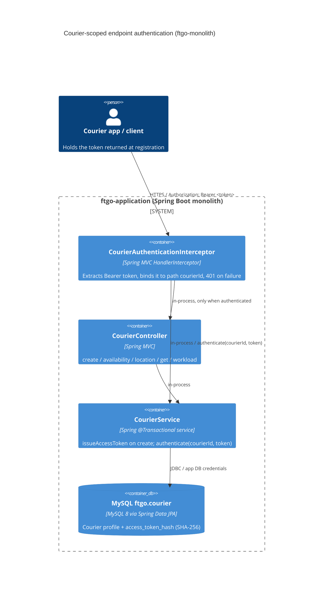

# 0001. Per-courier bearer token authentication for courier-scoped endpoints

- **Status:** Proposed
- **Date:** 2026-09-30
- **ARB ticket:** TO BE CREATED
- **Authors:** Devin (automated remediation of code-scan finding sfind-5772d058e8fa42098a772dcf66bfa31c)
- **Owning team:** TBD — owner to confirm before ARB (ftgo-courier-service maintainers)
- **Related ADRs:** none (first ADR in this repository)

## Context

`CourierController` exposed `POST /couriers/{courierId}/availability`, `POST /couriers/{courierId}/location`,
`GET /couriers/{courierId}` and `GET /couriers/{courierId}/workload` with no authentication or ownership
check. Courier ids are auto-increment `BIGINT`s, so any anonymous, network-reachable caller could enumerate
ids and toggle any courier's availability, overwrite any courier's location, or read any courier's plan and
workload (IDOR). Because the order service assigns deliveries based on courier availability and location,
this lets an attacker corrupt delivery assignment for every order.

The monolith has no authentication layer at all today (no Spring Security, no identity provider), and the
operations dashboard shipped in `ftgo-application` uses an in-browser mock API rather than these endpoints.
The only in-repo clients of the courier endpoints are the end-to-end tests.

ARB triggers: T6 (authentication / authorization change on public endpoints), T2 (new `courier.access_token_hash`
column — the `courier` table now stores a credential hash where it previously held only profile data).

## Decision

We will issue each courier an opaque, random access token at registration (`POST /couriers` returns it once in
`CreateCourierResponse.accessToken`), persist only its SHA-256 hash on the `courier` row, and require every
request to `/couriers/{courierId}` and `/couriers/{courierId}/**` to carry `Authorization: Bearer <token>`
whose hash matches the courier identified by the path. The check is enforced by a Spring MVC
`HandlerInterceptor` (`CourierAuthenticationInterceptor`) registered by `CourierWebConfiguration`, so it applies
to every current and future handler under those paths. Missing, malformed, unknown or mismatched tokens
fail closed with `401` and `WWW-Authenticate: Bearer`.

## Alternatives considered

| Alternative | Pros | Cons | Why rejected |
| --- | --- | --- | --- |
| Do nothing | No change | Anonymous IDOR on the whole fleet remains exploitable | Unacceptable integrity impact |
| Shared static API key for the courier API (header checked by a filter) | Trivial to implement; no schema change | Authenticates "a client" but not "this courier" — any key holder can still mutate every courier; key rotation is fleet-wide | Does not close the IDOR; only relabels it |
| Introduce Spring Security + external IdP (OIDC/JWT) for the whole monolith | Standard framework, covers consumers/restaurants too, ready for the microservice split | Large blast radius, new vendor/infra, breaks every existing client and the e2e suite; far outside the scope of one finding | Too large for a targeted remediation; recommended as a follow-up ARB item |
| Enforce in each controller method instead of an interceptor | No MVC config | Easy to forget on new endpoints; repeats the check 4x | Interceptor on the path pattern is fail-safe for future handlers |

## Architecture

## Non-functional requirements

| NFR | Target | How met |
| --- | --- | --- |
| Availability SLO | Unchanged from current monolith — TBD, owner to confirm before ARB | No new runtime dependency; check is in-process |
| p95 latency | + one indexed primary-key lookup and one SHA-256 per authenticated request | `courierRepository.findById` on PK; constant-time hash compare |
| RPO / RTO | Unchanged (same MySQL instance) | Token hash lives in the existing `courier` table and is covered by existing backups |
| Peak load | Unchanged — TBD, owner to confirm before ARB | N/A |
| Scaling model | Unchanged (stateless check, no session state) | Token verification needs no shared cache |
| Data retention | Token hash lives as long as the courier row | Same as courier profile data |

## Security & compliance

- **Data classification:** `access_token_hash` is a credential hash (Confidential). Raw tokens are never stored or logged; the token is returned exactly once in the registration response.
- **Encryption at rest:** Only the SHA-256 hash is persisted; at-rest encryption of MySQL is unchanged from current deployment (TBD — owner to confirm).
- **Encryption in transit:** Bearer tokens must only be sent over TLS; TLS termination is unchanged from current deployment (TBD — owner to confirm).
- **AuthN / AuthZ:** Bearer token authenticates the caller as a specific courier; authorization is the equality of the authenticated courier and the path `courierId` (no cross-courier access). `POST /couriers` (registration) remains open, as before.
- **Secrets:** Tokens are 256-bit `SecureRandom` values, URL-safe Base64; no shared secrets or configuration values introduced.
- **Audit logging:** Existing `ApiTrackingInterceptor` already records method, URI, status and correlation id for every request, so 401s from this check are captured. Authorization headers are not logged.
- **Data residency / regions:** Unchanged.
- **Policy sections satisfied:** No new infrastructure; no `approved-infra.yaml` in this repo.
- **Threats considered:** id enumeration (blocked — 401 without valid token for that id); token theft (mitigated by TLS and hash-only storage; rotation is a follow-up); timing side-channel on comparison (mitigated with `MessageDigest.isEqual`); existence oracle (unauthenticated requests get 401 whether or not the courier exists).

## Cost

| Item | Assumption | Monthly estimate |
| --- | --- | --- |
| Additional storage | one `VARCHAR(64)` per courier row | negligible |
| Additional compute | one PK lookup + SHA-256 per courier request | negligible |
| **Total** | | ~$0 (below any threshold) |

## Operations

- **On-call rotation:** Unchanged — TBD, owner to confirm before ARB.
- **Runbook:** N/A — no new runtime component; failures surface as HTTP 401 in the existing API request log.
- **Dashboards / alarms:** Existing `api_request_log` / Prometheus metrics; consider alerting on a spike of 401s under `/couriers/**`.
- **Rollback plan:** Revert the application change; the `access_token_hash` column is nullable and harmless if unused. Flyway migration V3 is additive.
- **Migration / cut-over plan:** Couriers created before V3 have `access_token_hash = NULL` and are therefore inaccessible via the courier API until re-registered or a token is issued for them out of band (fail closed). Any external clients of the courier endpoints must start sending the token returned at registration.

## Policy exceptions requested

| Rule | Resource | Justification | Compensating control | Expiry |
| --- | --- | --- | --- | --- |
| none | | | | |

## Consequences

- Positive: closes the IDOR; couriers can only act on their own record; future handlers under `/couriers/{courierId}/**` are protected automatically.
- Negative / risks: breaking change for any external caller of the courier endpoints (must send `Authorization`); pre-existing couriers need a token issued; no token rotation/revocation endpoint yet.
- Follow-ups: token rotation/revocation; decide who may call `POST /couriers` (currently open, as before); apply the same treatment to consumer/restaurant/order endpoints, ideally via a platform-wide Spring Security adoption (separate ARB item).

## Open questions

- Who owns ftgo-courier-service on-call and what is the current availability SLO?
- Should `POST /couriers` (courier registration) be restricted to operators in the same change?
- How should tokens be issued for couriers that already exist in production?
