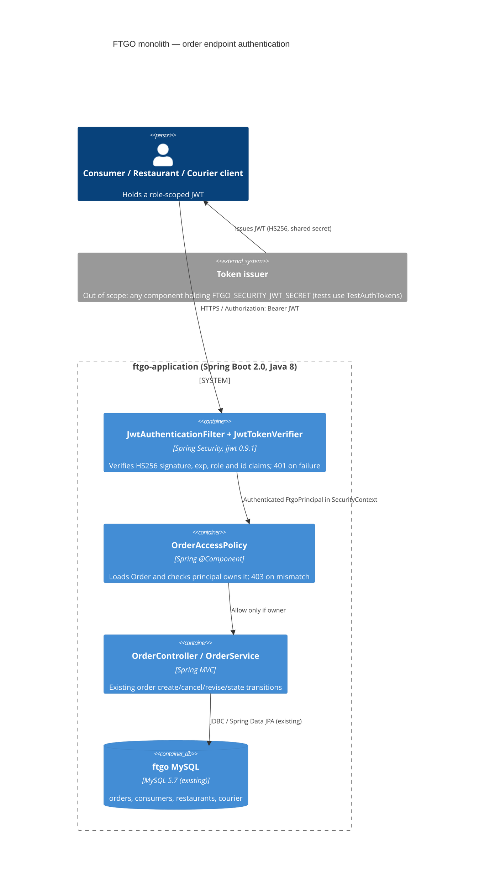

# 0001. JWT bearer authentication and ownership checks for order mutation endpoints

- **Status:** Proposed
- **Date:** 2026-09-30
- **ARB ticket:** TO BE CREATED
- **Authors:** Devin (security remediation for finding sfind-2b944267448a4b829780f95f40bc13b6)
- **Owning team:** TBD — owner to confirm before ARB (repo has no CODEOWNERS)
- **Related ADRs:** none (first ADR in this repository)

## Context

`OrderController` exposed `POST /orders` and `POST /orders/{orderId}/{cancel,revise,accept,preparing,ready,pickedup,delivered}`
with no authentication and no ownership check. Any remote caller could cancel/revise any order by guessing a sequential
numeric id, drive arbitrary state transitions, or create an order billed to any `consumerId` supplied in the body.
The application had no authentication layer at all, so there was no existing primitive to reuse.

Constraints: the FTGO monolith is a Spring Boot 2.0 / Java 8 application that is deliberately being decomposed into
services; the fix must be minimal, must not change the public request/response contracts for legitimate callers,
and must fail closed.

ARB triggers: T6 (authentication/authorization change: a new bearer-token authn mechanism and per-resource authz on
public HTTP endpoints). The detector also flagged T1 for `docker-compose.yml`; that is a false positive — the change
only passes a new environment variable to the existing `ftgo-application` container. `jjwt` is a local
signature-verification library that makes no network calls, so T3 is not triggered.

## Decision

We will require an `Authorization: Bearer <JWT>` header on all state-changing `/orders` endpoints, verified by a
Spring Security filter (`JwtAuthenticationFilter` → `JwtTokenVerifier`) using an HS256 shared secret
(`ftgo.security.jwt.secret` / `FTGO_SECURITY_JWT_SECRET`, ≥ 32 bytes). Tokens must carry `exp`, a `role` claim
(`CONSUMER` | `RESTAURANT` | `COURIER`) and the matching `consumerId` / `restaurantId` / `courierId` claim.
`OrderAccessPolicy` then enforces resource ownership before any mutation: consumers may only create orders for
their own `consumerId` and cancel/revise their own orders; restaurants may only accept/prepare/ready orders placed
at their restaurant; couriers may only pick up/deliver orders assigned to them. Missing/invalid token → 401,
wrong role or non-owner → 403. Read (GET) endpoints are unchanged.

## Alternatives considered

| Alternative | Pros | Cons | Why rejected |
| --- | --- | --- | --- |
| Do nothing | No change | Critical IDOR / unauthenticated mutation remains exploitable | Unacceptable security exposure |
| Static API key per role (e.g. `X-API-Key`) | Trivial to implement, no crypto library | Cannot identify *which* consumer/restaurant/courier is calling, so ownership checks are impossible; keys are long-lived and shared | Does not close the ownership half of the finding |
| Full OIDC / external IdP (Keycloak, Cognito) with Spring Security resource server | Standards-based, managed key rotation, revocation | Introduces a new deployable service and vendor dependency (T1/T3), far larger blast radius than a security fix; Spring Boot 2.0 lacks the built-in `oauth2ResourceServer` DSL | Out of scope for a minimal remediation; recommended follow-up |
| Ownership check only, trusting a caller-supplied `consumerId` header | Very small diff | Caller-controlled identity is exactly the vulnerability | Not a fix |

## Architecture

## Non-functional requirements

| NFR | Target | How met |
| --- | --- | --- |
| Availability SLO | Unchanged from existing service — TBD, owner to confirm before ARB | No new runtime dependency; verification is in-process |
| p95 latency | Negligible added latency (one HMAC verification + one existing `findById` per mutation) | Stateless filter; no network calls |
| RPO / RTO | Unchanged (no new data store) | N/A |
| Peak load | Unchanged — TBD, owner to confirm before ARB | Stateless, horizontally scalable |
| Scaling model | Same as existing application | Stateless sessions (`SessionCreationPolicy.STATELESS`) |
| Data retention | No new data stored | N/A |

## Security & compliance

- **Data classification:** Order and consumer identifiers (internal, non-PII). Tokens carry only role + numeric id.
- **Encryption at rest:** N/A — no new data stored. The shared secret is supplied via environment variable / secret store, never committed.
- **Encryption in transit:** Bearer tokens must be sent over TLS; TLS termination is the responsibility of the existing ingress (unchanged).
- **AuthN / AuthZ:** HS256 JWT verified in `JwtTokenVerifier` (signature, `exp` required, role + id claims required; unsigned/`none` tokens rejected by jjwt `parseClaimsJws`). Authorization in `OrderAccessPolicy` compares principal id with `Order.consumerId`, `Order.restaurant.id`, or `Order.assignedCourier.id`.
- **Secrets:** `FTGO_SECURITY_JWT_SECRET` (≥ 32 bytes). If unset, the app generates a random ephemeral key so *every* token is rejected (fail closed) and logs a warning. Tests use a clearly-labelled test-only default.
- **Audit logging:** Existing request logging unchanged; failed authentication yields 401 via `HttpStatusEntryPoint`. Follow-up: structured audit log of denied mutations.
- **Data residency / regions:** Unchanged.
- **Policy sections satisfied:** No infrastructure change; no `approved-infra.yaml` in this repo.
- **Threats considered:** IDOR on `orderId` (blocked by ownership check); identity spoofing via body `consumerId` (blocked by `requireConsumer`); token forgery (HMAC with ≥ 256-bit secret); replay of expired tokens (`exp` mandatory); role confusion (role-specific id claim enforced); `alg=none` (rejected by jjwt JWS parsing).

## Cost

| Item | Assumption | Monthly estimate |
| --- | --- | --- |
| Compute | In-process HMAC verification, no new infrastructure | $0 |
| **Total** | | $0 (below threshold) |

## Operations

- **On-call rotation:** Same as existing ftgo-application — TBD, owner to confirm before ARB.
- **Runbook:** README.adoc “Authentication for order endpoints” section (token format, required claims, secret configuration).
- **Dashboards / alarms:** Follow-up: alert on sustained 401/403 rate on `/orders/**`.
- **Rollback plan:** Revert the PR; no schema or data migration is involved.
- **Migration / cut-over plan:** Set `FTGO_SECURITY_JWT_SECRET` in every environment and update all order-mutating clients to send bearer tokens before deploying; clients without tokens will receive 401 after deploy.

## Policy exceptions requested

| Rule | Resource | Justification | Compensating control | Expiry |
| --- | --- | --- | --- | --- |
| none | | | | |

## Consequences

- Positive: closes an unauthenticated IDOR / mass-mutation vulnerability on all order-mutating endpoints; establishes a reusable `FtgoPrincipal` / role model for other services extracted from the monolith.
- Negative / risks: introduces a shared-secret trust model (whoever holds the secret can mint any identity) and two new compile dependencies (`spring-boot-starter-security`, `jjwt`); existing clients must be updated to send tokens.
- Follow-ups: move to asymmetric keys / an external IdP once one is approved; extend authentication to GET endpoints and to the consumer/restaurant controllers.

## Open questions

- Who owns `ftgo-application` operationally (on-call, SLO, peak load)? — TBD before ARB.
- Which component will issue production tokens? This ADR only covers verification.
