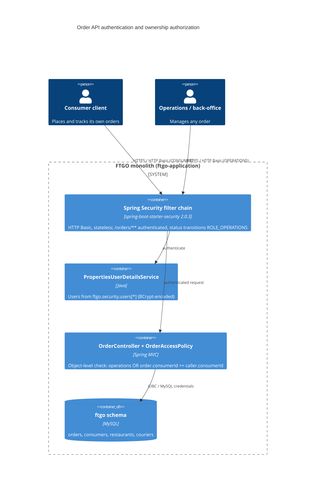

# 0001. Authenticate the order API and enforce per-consumer ownership

- **Status:** Proposed
- **Date:** 2026-09-30
- **ARB ticket:** TO BE CREATED
- **Authors:** Devin (code-scan remediation for finding sfind-ceebd44b129c44d1939c9f370dd3b0b7)
- **Owning team:** FTGO application owners (COG-GTM/ftgo-monolith maintainers)
- **Related ADRs:** none (first ADR in this repository)

## Context

`GET /orders/{orderId}` and `GET /orders?consumerId=N` in `ftgo-order-service` returned any order's
state, total, restaurant, courier and delivery ETA to anonymous callers. Order and consumer ids are
sequential `long`s, so an attacker could enumerate every consumer's order history (IDOR / missing
object-level authorization). The monolith had no authentication layer at all: the only servlet
interceptor (`ApiTrackingInterceptor`) always returns `true`.

Constraints: the application is a Spring Boot 2.0.x monolith; there is no identity provider, session
store or user table, and the e2e test suite and the operations dashboard drive the same HTTP API.

ARB triggers: T6 (authentication / authorization change on an existing public endpoint). The
heuristic detector reported NO_ARB; T6 was added by manual review of the diff.

## Decision

We will protect `/orders/**` with Spring Security (HTTP Basic, stateless) and enforce object-level
authorization in `OrderController` via `OrderAccessPolicy`. Identities are configured through
`ftgo.security.users[*]` properties (username, password or `{bcrypt}` hash, roles, optional
`consumerId`). `OPERATIONS` users may act on any order; `CONSUMER` users are bound to one consumer id
and can only create, read, list, revise or cancel that consumer's orders. The order-status
transitions used by restaurants and couriers (`accept`, `preparing`, `ready`, `pickedup`,
`delivered`) require `OPERATIONS`. All other endpoints keep their current (unauthenticated) behaviour
so the change is confined to the finding's attack path.

## Alternatives considered

| Alternative | Pros | Cons | Why rejected |
| --- | --- | --- | --- |
| Do nothing | No change | IDOR stays live; any caller can harvest all orders | Unacceptable security exposure |
| Trust a client-supplied identity header (e.g. `X-Consumer-Id`) | Trivial to implement | Forgeable; provides no real authentication | Does not break the attack path |
| Full OIDC / external IdP integration (Keycloak, Cognito) with JWTs | Production-grade identity, SSO | New infrastructure and vendor, large blast radius for a reference monolith | Out of scope for the remediation; can supersede this ADR later by swapping the `UserDetailsService` / filter |
| Secure every endpoint of the monolith now | Consistent posture | Breaks consumer/restaurant/courier flows and dashboards without a broader auth design | Kept for follow-up; this ADR scopes to `/orders/**` |

## Architecture

## Non-functional requirements

| NFR | Target | How met |
| --- | --- | --- |
| Availability SLO | Unchanged from current application (TBD — owner to confirm before ARB) | In-process filter, no new network dependency |
| p95 latency | + < 5 ms per request | BCrypt verification per request (stateless Basic); acceptable for current load, see open questions |
| RPO / RTO | Unchanged — no new state | Users live in configuration, not a data store |
| Peak load | TBD — owner to confirm before ARB | N/A |
| Scaling model | Unchanged (stateless) | `SessionCreationPolicy.STATELESS`, no session affinity needed |
| Data retention | Unchanged | No new data stored |

## Security & compliance

- **Data classification:** order data (consumer id, restaurant, totals, courier ETA) — internal / personal data.
- **Encryption at rest:** N/A — no new data store.
- **Encryption in transit:** HTTP Basic MUST be terminated behind TLS; deployment topology unchanged by this change (TBD — owner to confirm TLS termination before ARB).
- **AuthN / AuthZ:** Spring Security HTTP Basic against configured users; `OrderAccessPolicy` enforces ownership per order, `hasRole(OPERATIONS)` for status transitions; `ROLE_` authorities.
- **Secrets:** credentials injected via environment (`FTGO_OPERATIONS_USERNAME/PASSWORD` or `FTGO_SECURITY_USERS_n_*`); plaintext values are BCrypt-encoded at startup, `{bcrypt}` hashes accepted directly. The committed defaults are development-only and documented as such.
- **Audit logging:** controller-level 403s (and all authenticated requests) pass through the existing `ApiTrackingInterceptor` and are persisted in `api_request_log`. 401s are rejected by the Spring Security filter chain *before* the MVC interceptor runs and are therefore **not** recorded there today; capturing failed authentications (e.g. an `AuthenticationEntryPoint` that logs, or Spring Security's `AuthenticationFailureEvent`s) is listed under follow-up work.
- **Data residency / regions:** unchanged.
- **Policy sections satisfied:** no infrastructure change; no CDK resources.
- **Threats considered:** IDOR by id enumeration (closed by ownership check), consumer-id spoofing via query param (param ignored/forbidden unless it matches caller), credential brute force (BCrypt, stateless — rate limiting is a follow-up), information leak through existence oracle (403 vs 404 accepted; order ids are not secret).

## Cost

| Item | Assumption | Monthly estimate |
| --- | --- | --- |
| Compute | In-process filter, negligible CPU | $0 |
| **Total** | | $0 |

## Operations

- **On-call rotation:** TBD — owner to confirm before ARB.
- **Runbook:** configure users via `ftgo.security.users[*]` (see `ftgo-application/src/main/resources/application.properties`); a CONSUMER user must carry `consumerId`; startup fails fast on invalid entries.
- **Dashboards / alarms:** existing `api_request_log` / `/api/tracking` data; alert on sustained 401/403 spikes (follow-up).
- **Rollback plan:** revert the PR; no schema or data migration involved.
- **Migration / cut-over plan:** deploy with operations credentials set in the environment; update API clients (e2e tests already send Basic auth).

## Policy exceptions requested

| Rule | Resource | Justification | Compensating control | Expiry |
| --- | --- | --- | --- | --- |
| none | | | | |

## Consequences

- Positive: anonymous enumeration of orders is no longer possible; consumers cannot read or modify each other's orders; a clear seam exists to plug a real IdP later.
- Negative / risks: Swagger "Try it out" and any ad-hoc clients must now send credentials; static user configuration does not scale to real consumer self-service.
- Follow-ups: extend authentication to `/consumers`, `/restaurants`, `/couriers`; replace property-backed users with an IdP; add login rate limiting; record failed authentications (401s) in the audit trail, since they never reach `ApiTrackingInterceptor`; fail fast on the committed development credentials outside local/dev profiles.

## Open questions

- Which team owns the FTGO application on-call rotation and its availability SLO?
- Is TLS terminated in front of the application in every environment (required for HTTP Basic)?
- Expected peak request rate, to size the per-request BCrypt cost (strength can be lowered or a token scheme adopted).
