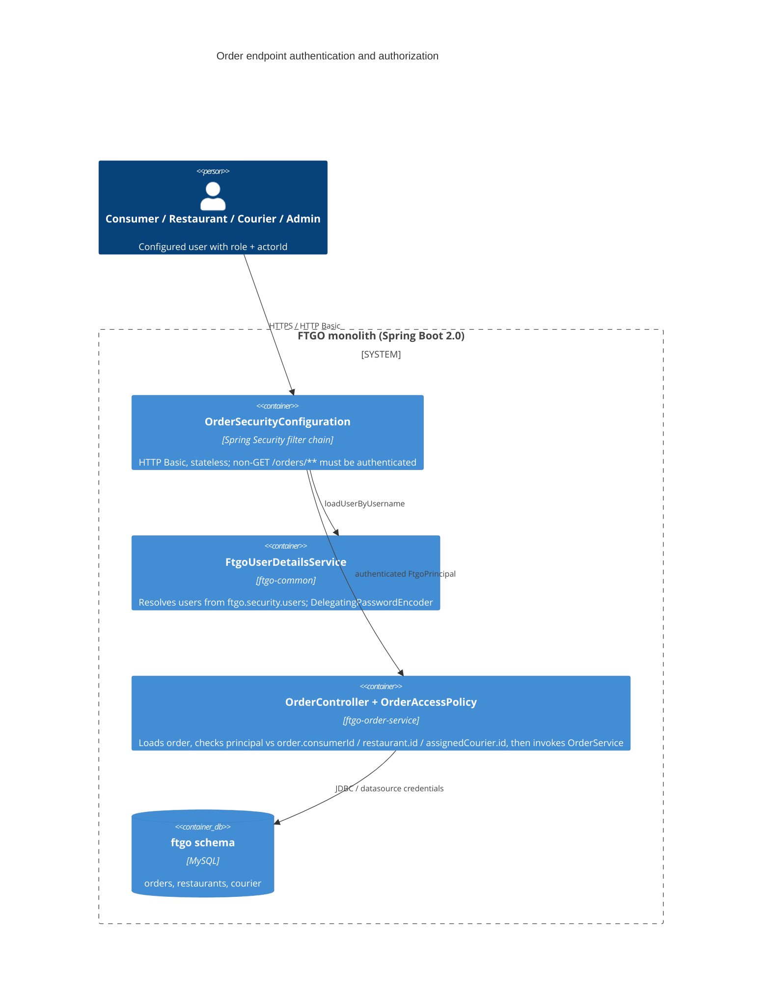

# 0001. Authentication and ownership-based authorization for order endpoints

- **Status:** Proposed
- **Date:** 2026-09-30
- **ARB ticket:** TO BE CREATED
- **Authors:** Devin (security remediation for finding sfind-2aaa1792716b4770b7ce17c5938bf4cc)
- **Owning team:** FTGO monolith maintainers (TBD — owner to confirm before ARB)
- **Related ADRs:** none (first ADR in this repository)

## Context

Every state-changing endpoint of the order service (`POST /orders`, `POST /orders/{id}/cancel|revise|accept|preparing|ready|pickedup|delivered`) was reachable anonymously and acted on whatever `orderId` / `consumerId` the caller supplied. Order ids are sequential integers, so any network peer could cancel, revise or falsely advance another user's order, or place orders on behalf of arbitrary consumers.

The monolith had no authentication layer at all: no Spring Security dependency, no filter, no notion of a caller identity. Fixing the finding therefore introduces the first authn/authz boundary in the application.

Constraints:

- Spring Boot 2.0.3 / Java 8; the fix must work with that stack.
- No identity provider or user store exists in the domain; consumers, restaurants and couriers are plain JPA aggregates without credentials.
- The change must not break the existing in-process application test and the external end-to-end tests beyond requiring them to authenticate.

ARB triggers: T6 (authentication / authorization change on public HTTP endpoints). Not triggered: T1, T2, T4, T5, T7, T9. T3 is not triggered because `spring-boot-starter-security` is an already-approved Spring Boot module with no outbound network calls. T8 is not triggered because the shared `ftgo-common` security package is consumed only inside this monolith.

## Decision

We will add Spring Security (HTTP Basic, stateless) to the monolith and require an authenticated caller for every non-`GET` request under `/orders`. Callers are configured users (`ftgo.security.users[*]`) with a role (`ADMIN`, `CONSUMER`, `RESTAURANT`, `COURIER`) and, for non-admin roles, the domain `actorId` they act as. `OrderController` binds the acting identity from the authenticated principal and delegates to `OrderAccessPolicy`, which allows consumers to create/cancel/revise only orders whose `consumerId` matches their `actorId`, restaurants to accept/prepare/ready only orders placed with their restaurant, couriers to pick up/deliver only orders assigned to them, and admins to act on any order. Requests without credentials get `401`; authenticated requests for orders the caller does not own get `403`. Read endpoints (`GET /orders/**`) keep their existing public behaviour.

## Alternatives considered

| Alternative | Pros | Cons | Why rejected |
| --- | --- | --- | --- |
| Do nothing | No change | Finding stays open; anyone can manipulate any order | Unacceptable security exposure |
| Shared API key on all order endpoints | Trivial to implement | Single credential shared by all callers; no ownership checks, so a consumer can still cancel other consumers' orders | Does not close the ownership part of the attack path |
| Role-only checks (`hasRole('CONSUMER')`) without ownership binding | Simple annotations | Any consumer can still act on any other consumer's order | Attack path only narrowed, not broken |
| External IdP (OIDC/JWT) with claims for actor ids | Production-grade identity, no in-app user list | Requires a new vendor/infrastructure (T3/T1), new secrets, out of scope for this remediation | Deferred; the principal/policy split introduced here is IdP-agnostic and can be re-wired to JWT later |

## Architecture

## Non-functional requirements

| NFR | Target | How met |
| --- | --- | --- |
| Availability SLO | Unchanged from current monolith (TBD — owner to confirm before ARB) | No new runtime dependency; users are resolved in memory |
| p95 latency | + < 5 ms per authenticated request | One extra `orderRepository.findById` (already needed by the transition) and an in-memory user lookup; password hashing cost depends on encoder id chosen in config |
| RPO / RTO | Unchanged | No new data store |
| Peak load | Unchanged | Stateless filter chain, no sessions |
| Scaling model | Unchanged (horizontal, stateless) | `SessionCreationPolicy.STATELESS` |
| Data retention | N/A — no new persisted data | |

## Security & compliance

- **Data classification:** order data (internal / customer PII in delivery address) — unchanged; credentials in configuration are secrets.
- **Encryption at rest:** N/A — no new data store. Configured passwords must be stored hashed (`{bcrypt}`); `{noop}` is for tests only.
- **Encryption in transit:** HTTP Basic requires TLS termination in front of the service (existing deployment concern; TBD — owner to confirm before ARB).
- **AuthN / AuthZ:** HTTP Basic against `ftgo.security.users`; authorization in `OrderAccessPolicy` bound to the principal's role and `actorId`, never to path/body ids. If no users are configured the service starts with a single `admin` user and a random generated password logged once (Spring Boot default-user behaviour) so the endpoints are never open.
- **Secrets:** user credentials supplied via Spring configuration (environment variables `FTGO_SECURITY_USERS_<n>_USERNAME/PASSWORD/ROLE/ACTORID` or a secrets-backed property source). Not committed to the repository; tests use `{noop}` passwords only.
- **Audit logging:** existing `ApiRequestLog` interceptor keeps recording requests; failed authentication is logged by Spring Security at DEBUG. Follow-up: include the principal in the API request log.
- **Data residency / regions:** unchanged.
- **Policy sections satisfied:** N/A — repository has no `policy/approved-infra.yaml`.
- **Threats considered:** anonymous state manipulation (blocked by 401), horizontal privilege escalation between consumers/restaurants/couriers (blocked by ownership checks → 403), order id enumeration (unauthenticated callers can no longer mutate; ids remain readable via existing public GET), credential stuffing (rate limiting is out of scope — see open questions).

## Cost

| Item | Assumption | Monthly estimate |
| --- | --- | --- |
| Additional infrastructure | none | $0 |
| **Total** | | $0 |

## Operations

- **On-call rotation:** unchanged (TBD — owner to confirm before ARB).
- **Runbook:** README section "Security" documents how to configure users; startup fails fast with a descriptive `IllegalStateException` for incomplete or duplicate user entries.
- **Dashboards / alarms:** none new; watch for 401/403 rate spikes on `/orders/**` via existing request logging.
- **Rollback plan:** revert the PR; the change is code-only and requires no data migration.
- **Migration / cut-over plan:** clients of `POST /orders/**` must start sending HTTP Basic credentials; the end-to-end tests read `FTGO_ADMIN_USERNAME` / `FTGO_ADMIN_PASSWORD`.

## Policy exceptions requested

| Rule | Resource | Justification | Compensating control | Expiry |
| --- | --- | --- | --- | --- |
| none | | | | |

## Consequences

- Positive: anonymous and cross-tenant order manipulation is no longer possible; acting identity comes from the authenticated principal; the role/actorId principal model is reusable for the consumer, restaurant and courier endpoints.
- Negative / risks: callers must now manage credentials; a configured user list is a stop-gap compared with a real IdP; HTTP Basic requires TLS in front of the service.
- Follow-ups: apply the same policy to consumer/restaurant/courier write endpoints; decide whether `GET /orders/**` should also be restricted; replace the configured user list with JWT/OIDC claims.

## Open questions

- Should `GET /orders/{id}` remain public, or be limited to the order's consumer/restaurant/courier?
- Which team owns credential provisioning for restaurants and couriers?
- Is TLS terminated in front of the service in all environments?
