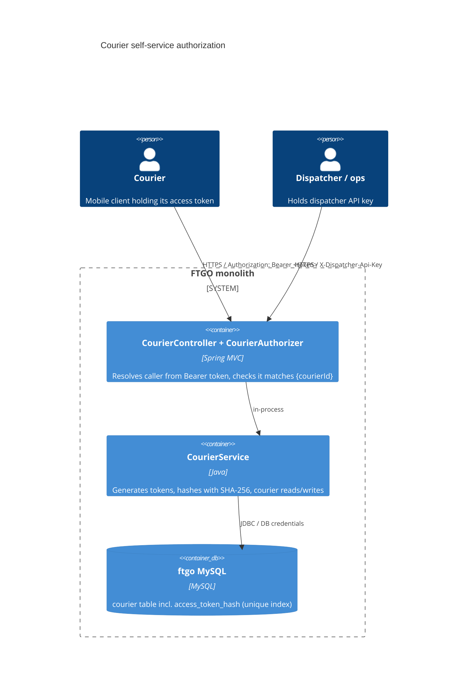

# 0002. Per-courier access tokens for courier self-service endpoints

- **Status:** Proposed
- **Date:** 2026-09-30
- **ARB ticket:** TO BE CREATED
- **Authors:** Devin (security remediation, finding sfind-d9cd6e62c57e43749e3f1ba6b4f2decc)
- **Owning team:** FTGO courier service owners (TBD — owner to confirm before ARB)
- **Related ADRs:** 0001-helm-chart-for-deployment (open on branch `devin/ab-404-helm-adr-arb`, unrelated)

## Context

Every `/couriers/{courierId}/**` endpoint in `ftgo-courier-service` was unauthenticated and took the
target courier id straight from the URL. Any anonymous caller could read a courier's record
(name, address, live GPS position, workload) and mutate it (flip availability, spoof location),
which also corrupts the distance-based courier-assignment algorithm used by the order service.
The monolith has no authentication layer at all (no Spring Security, no identity provider), so a
fix cannot simply "bind to the authenticated principal": a principal has to be introduced.

Constraints: Java 8 / Spring Boot 2.0.3 monolith; no IdP available; the end-to-end tests and the
operations dashboard must keep working; the change must not lock down the unrelated order,
consumer and restaurant APIs.

ARB triggers: T2 (schema change — `courier.access_token_hash` column), T6 (authorization change on
existing public endpoints). Heuristic detector reported T2 only; T6 added on manual review.

## Decision

We will issue each courier an opaque, random 256-bit access token when the courier is created
(`POST /couriers`), return it once in `CreateCourierResponse.accessToken`, and persist only its
SHA-256 hash in a new `courier.access_token_hash` column. All courier-scoped endpoints
(`GET /couriers/{id}`, `GET /couriers/{id}/workload`, `POST /couriers/{id}/availability`,
`POST /couriers/{id}/location`) require `Authorization: Bearer <token>`; the request is only
served when the courier resolved from the token is the courier in the path (401 for missing/invalid
credentials, 403 for a mismatch). An optional dispatcher role, granted by presenting the value of
`ftgo.courier.dispatcher-api-key` in the `X-Dispatcher-Api-Key` header, may act on any courier;
it is disabled unless the property is configured.

## Alternatives considered

| Alternative | Pros | Cons | Why rejected |
| --- | --- | --- | --- |
| Do nothing | No change | Anonymous IDOR on every courier remains; assignment logic can be manipulated platform-wide | Unacceptable security exposure |
| Introduce Spring Security + external IdP (OIDC) for the whole monolith | Standard, auditable, extensible to orders/consumers | No IdP exists today; would gate every endpoint and the dashboard; large blast radius for a targeted fix | Too large for this remediation; can supersede this ADR later |
| Restrict courier endpoints by network (internal-only ingress) | No code change | Couriers' mobile clients need to reach these endpoints; still no per-courier isolation | Does not break the attack path |
| HTTP Basic with per-courier passwords | Familiar | Requires password lifecycle/reset flows; credentials sent on every request | Same operational cost as tokens with weaker ergonomics |

## Architecture

## Non-functional requirements

| NFR | Target | How met |
| --- | --- | --- |
| Availability SLO | Unchanged from existing courier API (TBD — owner to confirm before ARB) | No new runtime dependency |
| p95 latency | + one indexed lookup per request (< 5 ms expected) | Unique index on `access_token_hash` |
| RPO / RTO | Unchanged (same MySQL database) | Column added to existing table |
| Peak load | Unchanged | Stateless check, no external call |
| Scaling model | Unchanged (stateless) | Token verification is a hash + indexed query |
| Data retention | Hash lives with the courier row | Deleted with the courier |

## Security & compliance

- **Data classification:** Courier PII (name, address, live GPS) — now only readable by the courier or a dispatcher.
- **Encryption at rest:** Only the SHA-256 hash of the token is stored; the plaintext token is never persisted or logged. Database encryption unchanged.
- **Encryption in transit:** Tokens are bearer credentials and must only be sent over TLS (TLS termination is outside the monolith — TBD owner to confirm).
- **AuthN / AuthZ:** AuthN via 256-bit random token generated with `SecureRandom`; AuthZ by comparing the resolved courier id with the path id. Dispatcher key compared with constant-time `MessageDigest.isEqual`.
- **Secrets:** Dispatcher key supplied via `ftgo.courier.dispatcher-api-key` (env `FTGO_COURIER_DISPATCHER_API_KEY`); no default, feature disabled when absent.
- **Audit logging:** Existing `ApiTrackingInterceptor` records every request with status; 403s are logged at WARN by `GlobalExceptionHandler`.
- **Data residency / regions:** Unchanged.
- **Policy sections satisfied:** N/A — no cloud infrastructure in this change.
- **Threats considered:** IDOR (fixed by ownership check), token theft (mitigated by TLS-only transport; rotation is a follow-up), timing attacks on dispatcher key (constant-time compare), enumeration of courier ids (returns 401/403 before touching the record).

## Cost

| Item | Assumption | Monthly estimate |
| --- | --- | --- |
| Storage | 64-byte column per courier row | negligible |
| **Total** | | $0 incremental |

## Operations

- **On-call rotation:** existing FTGO on-call (TBD — owner to confirm before ARB)
- **Runbook:** N/A — no new runtime component; see PR description for the API contract change.
- **Dashboards / alarms:** Existing `api_request_log` tracking; consider alerting on 401/403 spikes on `/couriers/**`.
- **Rollback plan:** Revert the application deploy. The Flyway V3 column is nullable and unused by the previous version, so it can stay in place.
- **Migration / cut-over plan:** Flyway V3 adds the nullable column and unique index. Couriers created before this change have no token and cannot self-serve until re-created or a token is issued (follow-up: dispatcher-driven token issue/rotation endpoint). Clients must persist the `accessToken` returned by `POST /couriers`.

## Policy exceptions requested

| Rule | Resource | Justification | Compensating control | Expiry |
| --- | --- | --- | --- | --- |
| none | | | | |

## Consequences

- Positive: closes anonymous read/write of any courier; no new dependency or infrastructure; unrelated APIs unaffected.
- Negative / risks: breaking API change for courier clients (must send the token); pre-existing couriers have no token; no rotation/revocation endpoint yet.
- Follow-ups: token rotation/revocation endpoint; protect `POST /couriers` behind the dispatcher role; supersede with a platform-wide identity layer when one is adopted.

## Open questions

- Owning team, on-call rotation and availability SLO to be confirmed before ARB.
- Whether `POST /couriers` (courier creation) should also require the dispatcher key.
