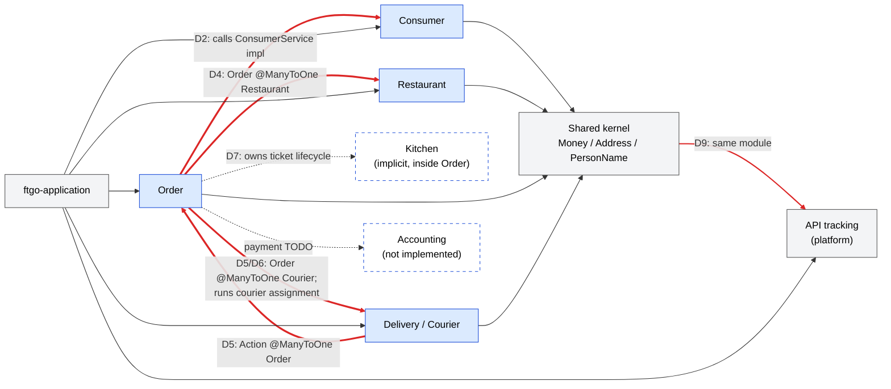
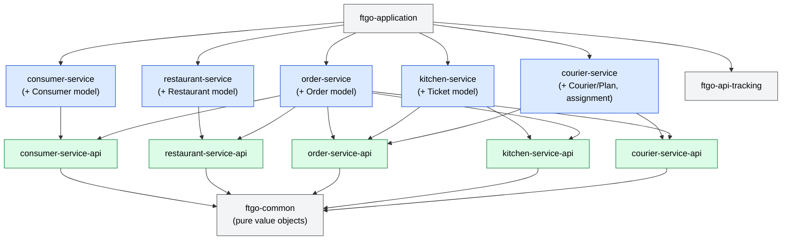

# FTGO Monolith — Bounded Context Map & Cross-Module Dependencies

This document maps the bounded contexts that exist (explicitly or implicitly) in
`ftgo-monolith`, shows how the Gradle modules and the code inside them depend on
each other, and calls out the dependencies that should not exist if each
context is to own its model and data.

It is a snapshot of `master` at the time of writing, derived from:

- `settings.gradle` and every module's `build.gradle` (`compile project(...)` edges)
- `import net.chrisrichardson...` statements in `src/main` of every module
- JPA mappings in `ftgo-domain` and the Flyway schema in `ftgo-flyway`
- Spring `@Configuration` / `@Import` wiring

See [How to regenerate](#how-to-regenerate) for the commands used.

---

## 1. Bounded contexts

The context names follow the FTGO domain model from *Microservices Patterns*
(the origin of this codebase). Several contexts exist only implicitly — their
concepts are present, but they have no module of their own.

| Context | Responsibility | Where it lives today | Status |
|---|---|---|---|
| **Consumer** | Consumer registration, order validation for a consumer | `ftgo-consumer-service`, `ftgo-consumer-service-api`; entity `Consumer` + `ConsumerRepository` in `ftgo-domain` | Module exists, model lives in shared `ftgo-domain` |
| **Restaurant** | Restaurants and their menus | `ftgo-restaurant-service`, `ftgo-restaurant-service-api`; entities `Restaurant`, `RestaurantMenu`, `MenuItem` + `RestaurantRepository` in `ftgo-domain` | Module exists, model lives in shared `ftgo-domain` |
| **Order** | Order placement, revision, cancellation | `ftgo-order-service`, `ftgo-order-service-api`; `Order`, `OrderLineItem(s)`, `OrderRevision`, `OrderState` + `OrderRepository` in `ftgo-domain` | Module exists, model lives in shared `ftgo-domain`; also absorbs Kitchen and part of Delivery |
| **Kitchen** (Ticket) | Restaurant accepts, prepares, and hands over an order | Merged into `Order`: states `ACCEPTED`/`PREPARING`/`READY_FOR_PICKUP`, `Order.acceptTicket/notePreparing/noteReadyForPickup`, `/orders/{id}/accept|preparing|ready` on `OrderController`. `TicketController` is an empty shell. | **Implicit — no module** |
| **Delivery** (Courier) | Couriers, availability/location, delivery plans, courier assignment | `ftgo-courier-service`, `ftgo-courier-service-api`; `Courier`, `Plan`, `Action`, `CourierAssignmentStrategy`, `DistanceOptimizedCourierAssignmentStrategy` + `CourierRepository` in `ftgo-domain`. Assignment is *executed* by `OrderService.scheduleDelivery`. | Module exists, but core behaviour lives in Order |
| **Accounting** (Payment) | Charging the consumer | Only `PaymentInformation` (a token on `Order`) and `// TODO - charge a credit card too` in `OrderService.createOrder` | **Implicit — not implemented** |
| *Shared kernel* | Value objects: `Money`, `Address`, `PersonName` | `ftgo-common`, JPA mapping in `ftgo-common-jpa` (`orm.xml`) | OK in principle, but polluted (see D9) |
| *Platform / infra* | API request tracking, Swagger, DB migrations, test utils | `ftgo-common` (`common.tracking`), `common-swagger`, `ftgo-flyway`, `ftgo-test-util` | API tracking wrongly lives in the shared kernel |
| *Composition root* | Boots all contexts into one Spring app | `ftgo-application` (`FtgoApplicationMain`, `GlobalExceptionHandler`) | OK |

---

## 2. Gradle module dependency graph (as-is)

Edges are `compile project(...)` dependencies from each `build.gradle`
(test-only edges are dashed). **Red edges are dependencies that should not
exist** — each is numbered and explained in [section 4](#4-dependencies-that-shouldnt-exist).

```mermaid
flowchart TB
    classDef app fill:#e8e8e8,stroke:#555,color:#000
    classDef svc fill:#dbeafe,stroke:#1d4ed8,color:#000
    classDef api fill:#dcfce7,stroke:#15803d,color:#000
    classDef shared fill:#fee2e2,stroke:#b91c1c,color:#000
    classDef infra fill:#fef9c3,stroke:#a16207,color:#000
    classDef test fill:#f3e8ff,stroke:#7e22ce,color:#000

    app["ftgo-application<br/>(composition root)"]:::app

    subgraph Consumer["Consumer context"]
        consumerSvc["ftgo-consumer-service"]:::svc
        consumerApi["ftgo-consumer-service-api"]:::api
    end
    subgraph Restaurant["Restaurant context"]
        restSvc["ftgo-restaurant-service"]:::svc
        restApi["ftgo-restaurant-service-api"]:::api
    end
    subgraph Order["Order context (+ Kitchen, + part of Delivery)"]
        orderSvc["ftgo-order-service"]:::svc
        orderApi["ftgo-order-service-api"]:::api
    end
    subgraph Delivery["Delivery context"]
        courierSvc["ftgo-courier-service"]:::svc
        courierApi["ftgo-courier-service-api"]:::api
    end

    domain["ftgo-domain<br/>ALL entities + repositories<br/>of every context"]:::shared
    common["ftgo-common<br/>Money/Address/PersonName<br/>+ API tracking (JPA, MVC)"]:::shared
    commonJpa["ftgo-common-jpa<br/>(orm.xml)"]:::infra
    swagger["common-swagger"]:::infra
    flyway["ftgo-flyway<br/>(single shared schema)"]:::infra
    testUtil["ftgo-test-util"]:::infra
    e2eCommon["ftgo-end-to-end-tests-common"]:::test
    e2e["ftgo-end-to-end-tests"]:::test

    %% composition root
    app --> consumerSvc
    app --> orderSvc
    app --> restSvc
    app --> courierSvc

    %% service -> own api
    consumerSvc --> consumerApi
    restSvc --> restApi
    orderSvc --> orderApi
    courierSvc --> courierApi

    %% api -> shared kernel
    consumerApi --> common
    restApi --> common
    orderApi --> common
    courierApi --> common

    %% services -> swagger
    consumerSvc --> swagger
    restSvc --> swagger
    orderSvc --> swagger
    courierSvc --> swagger

    %% shared domain
    consumerSvc --> domain
    restSvc --> domain
    orderSvc --> domain
    courierSvc --> domain
    domain --> common
    domain --> commonJpa
    commonJpa --> common

    %% cross-context edges
    orderSvc -->|"D2: uses ConsumerService impl"| consumerSvc
    orderSvc -.->|"D3: declared, unused"| consumerApi
    orderSvc -.->|"D3: declared, unused"| restApi

    %% tests
    app -. test .-> e2eCommon
    e2e -. test .-> e2eCommon
    e2eCommon --> consumerApi
    e2eCommon --> restApi
    e2eCommon --> orderApi
    e2eCommon --> courierApi
    orderSvc -. test .-> testUtil
    courierSvc -. test .-> testUtil

    %% 0-3 app->svc, 4-7 svc->api, 8-11 api->common, 12-15 svc->swagger,
    %% 16-19 svc->domain, 20 domain->common, 21 domain->commonJpa, 22 commonJpa->common,
    %% 23 order->consumerSvc, 24-25 unused api deps
    linkStyle 16,17,18,19 stroke:#dc2626,stroke-width:3px
    linkStyle 23 stroke:#dc2626,stroke-width:3px
    linkStyle 24,25 stroke:#dc2626,stroke-width:2px,stroke-dasharray:4
    linkStyle 15 stroke:#f59e0b,stroke-width:2px,stroke-dasharray:4
```



Notes:

- `svc → ftgo-domain` (D1) is drawn red for every context: it is the root cause
  of most other problems, because `ftgo-domain` gives every module compile-time
  access to every other context's entities and repositories.
- `ftgo-courier-service → common-swagger` (amber) is declared but unused —
  `CourierWebConfiguration` never imports `CommonSwaggerConfiguration` (minor, D11).
- `ftgo-flyway` has no code dependencies; it is included to show that all
  contexts share one schema (D10).

---

## 3. Context-level dependency map (code, not just Gradle)

The Gradle graph hides most of the real coupling, because it all flows through
`ftgo-domain`. This view shows which **context uses which other context's model
or behaviour**, based on imports, JPA associations and database foreign keys.



What is *healthy* here:

- **Order → Consumer by ID.** `Order.consumerId` is a plain `Long` and
  `orders.consumer_id` has no FK. This is the pattern the other associations
  should follow.
- **Order snapshots menu data.** `OrderLineItem` copies `menuItemId`, `name` and
  `price` from the restaurant menu at order time, so line items are already
  decoupled from `Restaurant`.
- **Restaurant, Consumer and Delivery modules do not depend on each other**
  at the Gradle level; all their cross-talk goes through Order.
- **`*-api` modules** depend only on the shared kernel, and the end-to-end tests
  depend only on `*-api` modules.
- **`ftgo-application`** depending on every context (and
  `GlobalExceptionHandler` knowing their exceptions) is expected of a
  composition root.

---

## 4. Dependencies that shouldn't exist

Ordered roughly by impact on the ability to extract a context.

### D1. Every service depends on a shared `ftgo-domain` module holding every context's model — **critical**

- `ftgo-{consumer,restaurant,order,courier}-service/build.gradle` all declare
  `compile project(":ftgo-domain")`.
- `ftgo-domain` contains the aggregates of four contexts (`Consumer`,
  `Restaurant`, `Order`, `Courier`), all their repositories, and Delivery
  business logic (`DistanceOptimizedCourierAssignmentStrategy`).
- `DomainConfiguration` is `@ComponentScan @EntityScan @EnableJpaRepositories`
  over the whole package, and each service `@Import`s it, so e.g. the Courier
  context's Spring context gets `OrderRepository`, `ConsumerRepository` and
  `RestaurantRepository` beans.
- **Why it's wrong:** nothing stops any context from reading or writing any
  other context's tables; D2–D6 are all consequences of this.
- **Should be:** split `ftgo-domain` per context (e.g. `Consumer` →
  `ftgo-consumer-service`, `Restaurant`/`MenuItem` → `ftgo-restaurant-service`,
  `Order*` → `ftgo-order-service`, `Courier`/`Plan`/`Action`/assignment strategy
  → `ftgo-courier-service`), each with its own `@EnableJpaRepositories`.

### D2. `ftgo-order-service` → `ftgo-consumer-service` (implementation module) — **high**

- `ftgo-order-service/build.gradle`: `compile project(":ftgo-consumer-service")`.
- `OrderService` / `OrderConfiguration` import
  `net.chrisrichardson.ftgo.consumerservice.domain.ConsumerService` and call
  `validateOrderForConsumer(consumerId, orderTotal)`.
- **Why it's wrong:** Order binds to Consumer's internal service class (and
  transitively its controllers, Swagger config, etc.). It's the only
  service-to-service Gradle edge in the build.
- **Should be:** a `ConsumerVerification` port (interface + DTOs) in
  `ftgo-consumer-service-api`, implemented in `ftgo-consumer-service`, with
  Order depending only on the API module.

### D3. `ftgo-order-service` → `ftgo-consumer-service-api` / `ftgo-restaurant-service-api` declared but unused — **low (but telling)**

- `ftgo-order-service/build.gradle` declares both, but no class in
  `ftgo-order-service/src/main` imports `consumerservice.api` or
  `restaurantservice.events`.
- **Why it's wrong:** these are the edges that *should* carry the cross-context
  traffic; instead Order bypasses them via D1/D2. Either use them (preferred,
  see D2/D4) or remove them.

### D4. Order → Restaurant entity reference — **high**

- `Order` has `@ManyToOne(fetch = LAZY) private Restaurant restaurant;`
  (`orders.restaurant_id` FK → `restaurants`).
- `OrderService.createOrder` loads the `Restaurant` aggregate via
  `RestaurantRepository` and walks `findMenuItem(...)`.
- `OrderController.makeGetOrderResponse` returns `order.getRestaurant().getName()`;
  `OrderService.estimateDeliveryTime` reads `order.getRestaurant().getAddress()`.
- **Why it's wrong:** Order reaches into Restaurant's aggregate and table.
- **Should be:** `Order.restaurantId` (plain ID) plus a snapshot of what Order
  needs (restaurant name, pickup address); menu lookup via a Restaurant API
  port or an Order-owned replica of menus.

### D5. Order ⇄ Courier bidirectional entity cycle — **critical**

- `Order` has `@ManyToOne private Courier assignedCourier;`
  (`orders.assigned_courier_id` FK → `courier`).
- `Courier` → `Plan` → `List<Action>`, and `Action` has
  `@ManyToOne private Order order;` (`courier_actions.order_id` FK → `orders`).
- **Why it's wrong:** a compile-time *and* schema-level cycle between two
  contexts. Neither table set can be moved without the other.
- **Should be:** `Order.assignedCourierId` (or no courier reference at all —
  Delivery owns "who delivers what") and `Action.orderId` as a plain ID.

### D6. Order context executes Delivery's business logic — **high**

- `OrderService.accept` → `scheduleDelivery`: loads `CourierRepository.findAllAvailable()`,
  runs `CourierAssignmentStrategy.assignCourier(...)`, mutates the `Courier`
  aggregate (`courier.addAction(Action.makePickup/makeDropoff)`), and computes
  ETAs with `DistanceOptimizedCourierAssignmentStrategy.haversineDistance` — all
  inside the Order transaction.
- `OrderConfiguration` defines the `CourierAssignmentStrategy` bean.
- `OrderController.makeGetOrderResponse` walks
  `order.getAssignedCourier().actionsForDelivery(order)` to compute the ETA.
- **Why it's wrong:** Delivery's core decision (courier assignment) is owned by
  Order; `ftgo-courier-service` is reduced to CRUD on `Courier`.
- **Should be:** Order publishes "order accepted / ready by T"; Delivery
  (`ftgo-courier-service`) assigns the courier and owns the plan; Order queries
  Delivery through `ftgo-courier-service-api` for ETA/courier if needed.

### D7. Kitchen context folded into the Order aggregate — **medium** (missing boundary)

- `OrderState` mixes Order (`APPROVED`, `CANCELLED`), Kitchen (`ACCEPTED`,
  `PREPARING`, `READY_FOR_PICKUP`) and Delivery (`PICKED_UP`, `DELIVERED`) states.
- Kitchen endpoints (`/orders/{id}/accept|preparing|ready`) and delivery
  endpoints (`/orders/{id}/pickedup|delivered`) are on `OrderController`;
  `TicketController` exists but has no endpoints.
- **Should be:** a `Ticket` aggregate in a Kitchen module; Order state reduced
  to its own lifecycle, updated from Kitchen/Delivery.

### D8. REST contracts expose JPA entities from `ftgo-domain` — **medium**

- `CourierController.get` returns `ResponseEntity<Courier>` (the entity, incl.
  its `Plan`).
- `GetOrderResponse.courierActions` is `List<net.chrisrichardson.ftgo.domain.Action>`.
- **Why it's wrong:** the public API of Order and Delivery is coupled to the
  shared persistence model, so D1/D5 leak to clients.
- **Should be:** DTOs in `ftgo-courier-service-api` / `ftgo-order-service-api`.

### D9. Shared kernel (`ftgo-common`) carries platform infrastructure — **medium**

- `ftgo-common` contains `common.tracking` (`ApiRequestLog` JPA entity,
  `ApiRequestLogRepository`, `ApiTrackingInterceptor`, `ApiTrackingController`)
  and depends on `spring-boot-starter-data-jpa`, `spring-boot-starter-web` and
  `mysql-connector-java`.
- `CommonConfiguration` is `@ComponentScan` + `@EnableJpaRepositories` for the
  tracking package and is imported by `DomainConfiguration`, so every context
  boots the tracking controller/repository.
- Every `*-api` module depends on `ftgo-common`, so API/contract jars
  transitively pull in JPA, Spring MVC and the MySQL driver.
- `ftgo-common/build.gradle` already carries `// TODO eliminate this` for the
  JPA dependency; `ftgo-common-jpa/orm.xml` was meant to hold the mappings, but
  `Money`/`Address`/`PersonName` are still annotated `@Embeddable`.
- **Should be:** `ftgo-common` = pure value objects (no Spring/JPA); move
  `common.tracking` to its own platform module wired only by `ftgo-application`
  (it is already `@Import`ed there explicitly).

### D10. One shared schema with cross-context foreign keys — **high** (data-level)

- `V1__create_ftgo_db.sql`: `orders_restaurant_id` (orders → restaurants),
  `orders_assigned_courier_id` (orders → courier),
  `courier_actions_order_id` (courier_actions → orders).
- **Should be:** drop cross-context FKs as part of D4/D5 and move to
  per-context schemas/migration sets. `consumer_id` (no FK) is the model.

### D11. Minor

- `ftgo-courier-service` → `common-swagger` is declared but unused.
- `NoCourierAvailableException` (a Delivery concept) lives in `ftgo-domain` and
  is handled in `ftgo-application`'s `GlobalExceptionHandler` — fine for a
  composition root, but it should move with the Delivery model.

---

## 5. Target state (sketch)

What the module graph would look like once D1–D6 are addressed: each context
owns its model; the only cross-context edges go to `*-api` modules.



(Kitchen/Delivery → `order-service-api` would carry event/DTO types only,
e.g. "ticket ready", "order picked up"; the in-process equivalent is a Spring
`ApplicationEvent` or a port interface implemented by Order.)

---

## Assumptions

- Context boundaries follow the FTGO domain as described in *Microservices
  Patterns* (Consumer, Restaurant, Order, Kitchen, Delivery, Accounting); the
  existing `*-service` module split is taken as the intended boundary.
- "Shouldn't exist" is judged against the goal stated in the README (refactor
  toward services): each context owns its model and data and talks to others
  only through its `*-api` module or IDs.
- Analysis is static (build files, imports, JPA annotations, SQL); runtime-only
  coupling (e.g. reflection, shared transactions beyond what the code shows)
  is not covered. Test-only dependencies are shown but not flagged.
- `ftgo-end-to-end-tests*`, `ftgo-test-util`, `buildSrc` are treated as
  tooling, not contexts.

## How to regenerate

```bash
# Gradle module edges
for f in */build.gradle; do echo "== $f"; grep -n 'project(' "$f"; done

# Cross-package imports per module (main code only)
for m in ftgo-*/ common-swagger; do
  echo "== $m"
  rg -o --no-filename '^import (static )?net\.chrisrichardson\.[a-zA-Z.]+' "$m/src/main" \
    | sed 's/import \(static \)\?//' | sort | uniq -c | sort -rn
done

# Cross-aggregate JPA associations and cross-table FKs
rg -n '@ManyToOne|@OneToOne|@OneToMany|@ManyToMany' ftgo-domain/src/main
rg -n 'foreign key' ftgo-flyway/src/main/resources/db/migration
```
